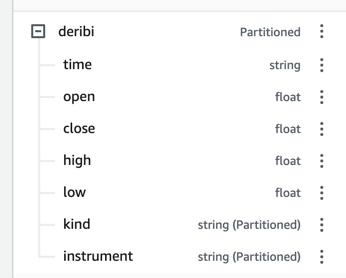
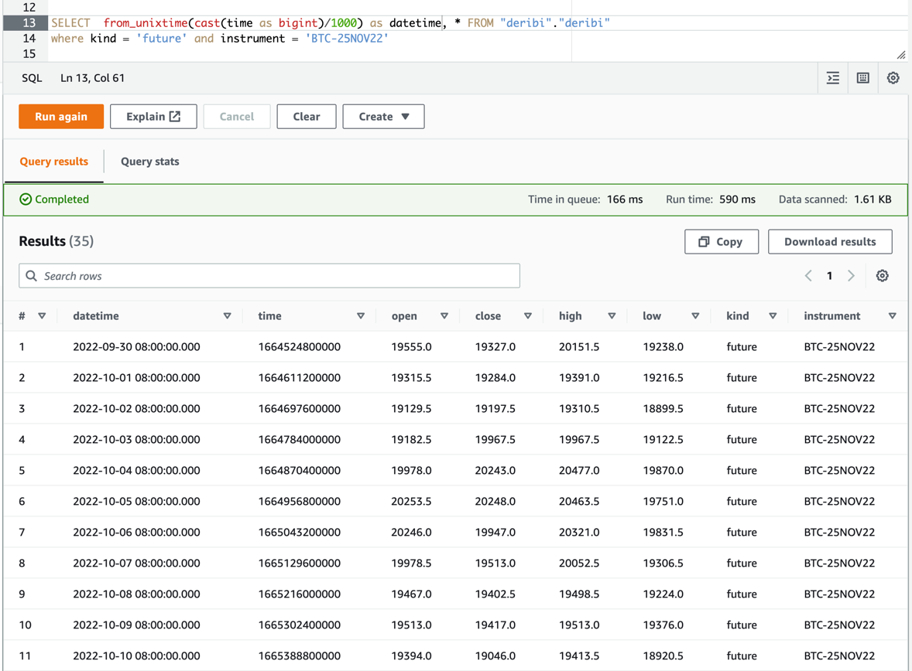

# This project contains code for ingesting DeribitAPI data to AWS S3

___
### Deribit <a href="https://docs.deribit.com/?shell#deribit-api-v2-1-1">API</a>

We are using 2 main free endpoints here:
1. Getting all available non-expired instruments using <a href="https://docs.deribit.com/?shell#public-get_instruments">public-get_instruments endpoint</a> 
2. Get historical data per  instrument  <a href="https://docs.deribit.com/?shell#public-get_tradingview_chart_data">public-get_tradingview_chart_data endpoint</a> 

### Some tips:
 - Default currency is ```BTC```
 - First run retrieve all the data available historically  from ```1970-01-01``` till ```current_timestamp```
 - Next runs will be incremental per ```kind``` and ```instrument```
   - Like: ```kind=option``` and ```instrument=BTC-11NOV22-10000-P```
   - Automatically detects last timestamp ingested for this combination using S3 file names
   - Get only new data starting from last ingested timestamp till now
 - Script will add new `.csv` file per `run` per `kind` and `instrument` to S3
---

# AWS infrasructure

All the data is stored in S3 bucket called ```deribi-instruments``` under ```/ingestion``` folder
Next S3 folder sructure is as following:
```
/ingestion/
   kind=future/
      instrument=BTC-25NOV22/
         ...
      instrument=BTC-PERPETUAL/
         2022-10-01 00:00:00.csv
         2022-10-02 00:00:00.csv
         2022-10-03 00:00:00.csv
         ...
      ...
   kind=option/
   ...
```

Then we have Glue Data Catalog table on top of those file created using Athena [query](https://github.com/Dudar99/deribit-ingest/blob/main/athena_sql/create_table.sql)

Please be aware that table is partitioned by ```kind``` and `instrument`



And we can query now more efficiently and cost effective:


---

# Possible Lambda architecture

To split workload across all instruments we can use 2 kins of Lambdas
1. _Scheduler Lambda_ that will fetch all available instruments and trigger parallel runs of 2nd kind of Lambdas
2. _Worker Lambda_ will take arguments from _Scheduler Lambda_ and ingest data to S3

---

### Prerequisites

1. _First of all make sure that you have AWS Account available_

2. _Then create Glue Data Catalog and execute Athena query from this doc_

3. _Create S3 bucket called ``deribi``_

  ```sh
  export AWS_ACCESS_KEY_ID=AWS_ID_PROVIDED_AFTER_REGISTRATION
  export AWS_SECRET_ACCESS_KEY=AWS_SECRET_ACCES_KEY_AFTER_REGSTRATION
  ```

## Usage

Here is example how to use our pipeline

__Run ingestion without argument( script will automatically determine timestamps ):__

   ```sh
   python main.py 
   ```
__Run using timestamps:__

   ```sh
   python main.py -s 1664524800000 -e 1664956800000
   ```

